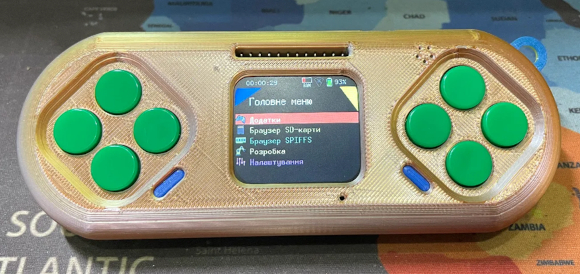

# KeiraOS

[][discord]

KeiraOS, операційна система для консолей []

## 🛠️ Як прошити Lilka (KeiraOS)

### 1. Відкрити інструмент прошивки  
Перейдіть на сторінку [ESPTool (в браузері)](https://espressif.github.io/esptool-js/)  
> ⚠️ Працює лише в Google Chrome або Chromium-браузерах.

---

### 2. Завантажити прошивку KeiraOS  
Завантажте останній файл [`KeiraOS_merged.bin`](https://github.com/lilka-dev/keira/releases)

---

### 3. Підключити плату Lilka до комп’ютера

#### 🔌 Вибір правильного USB-кабелю
**USB-кабель має підтримувати передачу даних!**  
❌ Не всі USB-C ↔ USB-C кабелі працюють (деякі тільки заряджають)  
✅ Рекомендовані варіанти:
- USB-A 2.0 або 3.0 ↔ USB-C  
- ❌ USB-C ↔ USB-C НЕ РЕКОМЕНДУЄТЬСЯ

---

#### 🚀 Вхід у режим завантаження (Boot mode)
Якщо прошивка не починається або пристрій не визначається:
1. Від’єднайте USB-кабель (живлення)
2. Натисніть і утримуйте кнопку `BOOT(SELECT)` на платі
3. Під’єднайте USB до комп’ютера
4. Відпустіть кнопку `BOOT(SELECT)` після підключення

> Тепер пристрій буде в режимі прошивки

---

### 4. Підключення до ESPTool
- Натисніть кнопку **“Connect”** на сторінці ESPTool
- Виберіть порт COM або `/dev/ttyUSBx`
- Дозвольте браузеру доступ до пристрою

---

### 5. Очистити Flash-пам’ять
Натисніть **“Erase Flash”**  
> 🔄 Рекомендується перед кожною новою прошивкою

---

### 6. Прошити KeiraOS

1. Натисніть **"Program"**
2. Виберіть файл `KeiraOS_merged.bin`
3. У полі адреси введіть: `0x0`
4. Натисніть **"Program"** ще раз
5. Дочекайтесь повідомлення **“Success”**

---

### ✅ Після прошивки:
- Натисніть кнопку **RESET** на платі або перезавантажте пристрій вручну  
> Прошивка має автоматично запуститися

---

### 💡 Поради для новачків:
- Якщо нічого не працює — **перевір кабель, порт або браузер**  
- Якщо не прошивається — **спробуйте ще раз зайти в Boot Mode**
- **Прошивати можна скільки завгодно — це безпечно**

---

## Документація

Повна документація проєкту буде доступна ось тут: <https://docs.lilka.dev/projects/keira/uk/latest/>

## Спільнота

Приєднуйтесь до [нашого сервера в Discord][discord]!

## Я хочу допомогти писати код!

Ми будемо тільки раді! Є декілька варіантів:

- Хочете написати гру, програму, документацію чи щось таке? Звісно! Документація є [тут (C++)](https://docs.lilka.dev/projects/keira/uk/latest/custom_apps/) і [тут (Lua)](https://docs.lilka.dev/projects/keira/uk/latest/lua/intro/).
- Хочете допомогти з вдосконаленням коду? Виконайте команду `make todo` - вона відобразить всі TODO з коду, де потрібна допомога.
- Хочете допомогти ідейно? Знайшли баг або маєте ідею щодо покращення архітектури? Створіть новий тікет або пишіть в наш [Discord][discord] в форум `#лілка`.

[discord]: https://discord.gg/HU68TaKCu6
